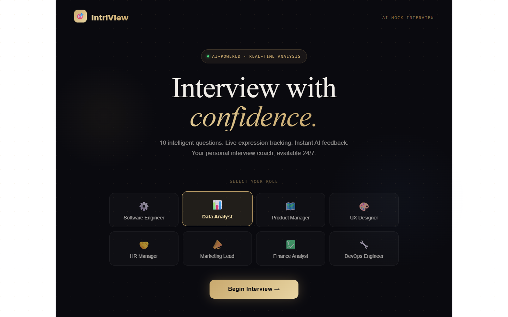
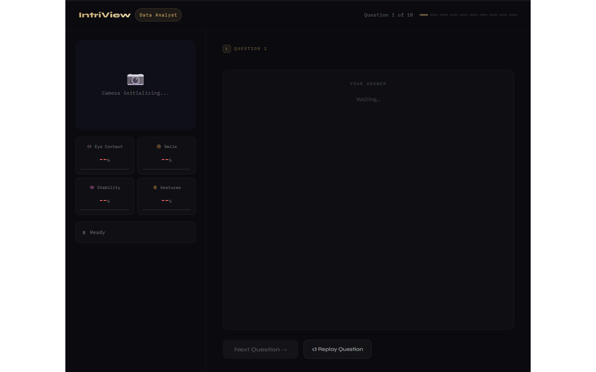
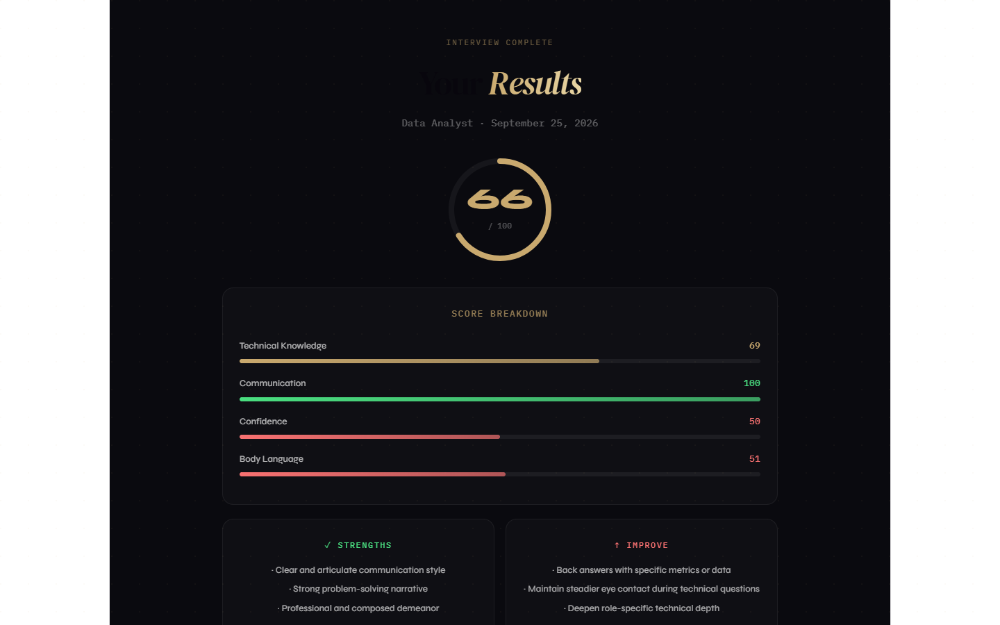

# IntriView — AI Mock Interview Platform

An AI-powered mock interview platform that conducts real-time interviews, tracks facial expressions and body language via webcam, and delivers a detailed performance report.



---

## Features

- **AI-Generated Questions** — 10 role-specific questions generated by Claude AI
- **Live Webcam Analysis** — real-time tracking of eye contact, smile, head stability, and gestures
- **Speech Recognition** — answers recorded via browser microphone (Web Speech API)
- **Instant Score Report** — overall score, category breakdown, strengths, and improvement areas
- **8 Job Roles** — Software Engineer, Data Analyst, Product Manager, UX Designer, HR Manager, Marketing Lead, Finance Analyst, DevOps Engineer

---

## Screenshots

| Landing | Interview | Results |
|---|---|---|
|  |  |  |

---

## Tech Stack

| Layer | Tech |
|---|---|
| Framework | React 18 + Vite |
| Styling | CSS keyframes + inline styles |
| AI | Claude API (claude-sonnet-4) |
| Vision | Canvas API (real-time facial analysis) |
| Speech | Web Speech API |
| Fonts | DM Serif Display, Syne, IBM Plex Mono |

---

## Getting Started

### Prerequisites
- Node.js 18+
- Anthropic API key → [console.anthropic.com](https://console.anthropic.com)

### Installation

```bash
git clone https://github.com/ahmaddrashid0/intriview.git
cd intriview
npm install
```

### Add your API key

Open `src/App.jsx` and replace the mock `callClaude` function with:

```js
const callClaude = async (messages, systemPrompt) => {
  const res = await fetch("https://api.anthropic.com/v1/messages", {
    method: "POST",
    headers: {
      "Content-Type": "application/json",
      "x-api-key": "YOUR_ANTHROPIC_API_KEY",
      "anthropic-version": "2023-06-01",
      "anthropic-dangerous-direct-browser-access": "true",
    },
    body: JSON.stringify({
      model: "claude-sonnet-4-20250514",
      max_tokens: 1000,
      system: systemPrompt,
      messages,
    }),
  });
  const data = await res.json();
  return data.content?.[0]?.text || "";
};
```

### Run

```bash
npm run dev
```

Open [http://localhost:5173](http://localhost:5173)

---

## How It Works

1. **Select a role** on the landing page
2. **Grant camera and microphone** access when prompted
3. **Listen** to each question (spoken aloud by the browser)
4. **Answer** verbally — your speech is transcribed in real time
5. After 10 questions, receive a **full performance report**

---

## Project Structure

```
src/
└── App.jsx        # Entire app — landing, interview, and results pages
screenshots/       # UI screenshots
```

---

## Academic Context

Built as a Final Year Project (FYP) — *IntriView: AI Mock Interview Platform*.

---

## License

MIT
